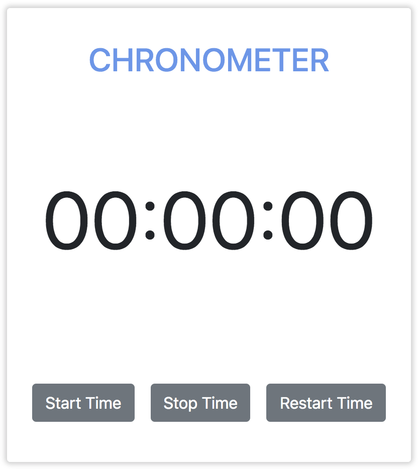

# Chronometer
[Demo](https://tbm85.github.io/Demo-Chronometer/)

## Description
This is a simple chronometer made with Angular 8, that allows you to start, stop and restart the time. 

## Resources
* [Angular CLI](https://github.com/angular/angular-cli) version 8.3.21.
* [Bootstrap 4](https://getbootstrap.com/)

## How to run this app
* Clone: `git clone https://tbm85.github.io/Demo-Chronometer`
* Enter in the directory: `cd Demo-Chronometer`
* Install dependencies: `npm install`
* Run the app: `ng serve`
* Navigate to: `http://localhost:4200/`

## License
Copyright (c) 2020 Tania Ballester Marsal. This project is using [MIT License](LICENSE.md)

