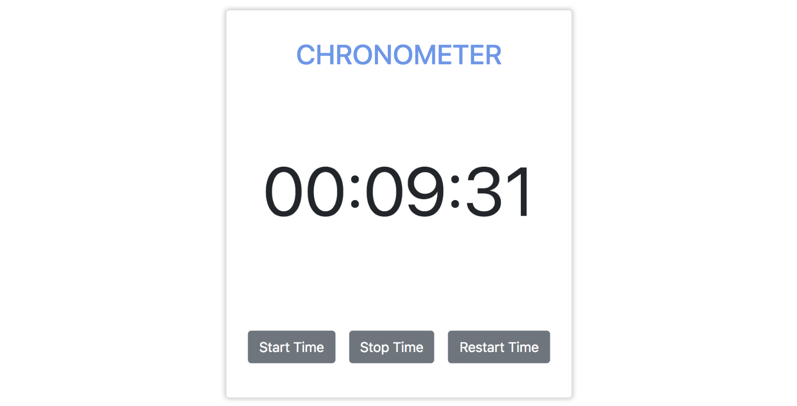

# Chronometer

[Demo](https://tbm85.github.io/Demo-Chronometer/)

## Description
This is a simple chronometer made with Angular, that allows you to start, stop and restart the time. This project was generated with [Angular CLI](https://github.com/angular/angular-cli) version 8.3.21.

## Resources
* [Bootstrap 4](https://getbootstrap.com/)

## How to run this app
* Clone: git clone https://tbm85.github.io/Demo-Chronometer
* Enter in the directory: cd Demo-Chronometer
* Install dependencies: npm install
* Run the app: ng serve

## License
Copyright (c) 2020 Tania Ballester Marsal. This project is using [MIT License](LICENSE.md)

